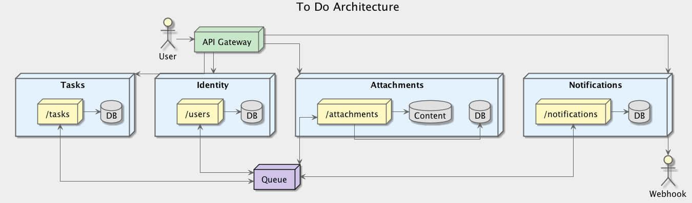

# To Do OpenAPI Specification

This repository contains an OpenAPI specification for the fictional To Do system shown in the section below.

## Architecture

## Requirements
* Manage user registration, authentication and authorisation
* Manage a set of tasks for a user
* Manage a set of attachments for a task
* Manage custom metadata for a task
* Manage notifications to 3rd party systems
